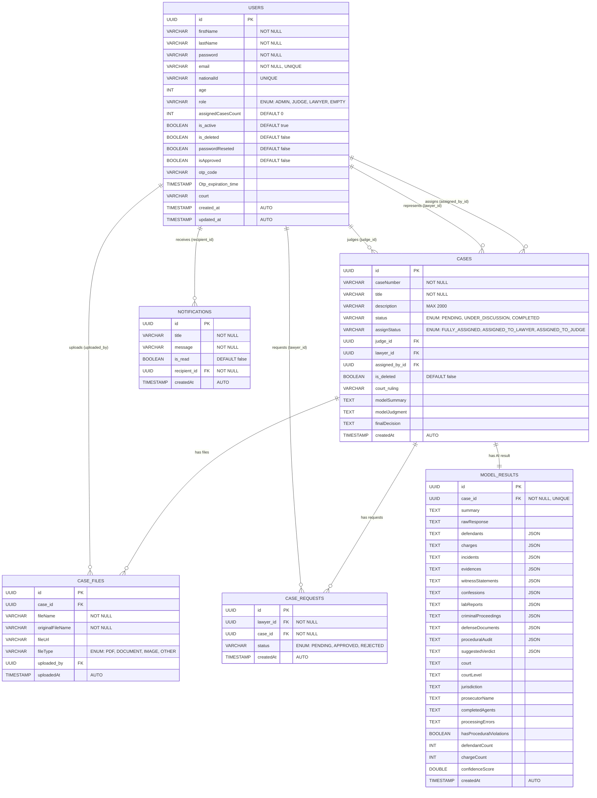

<](https://spring.io/projects/spring-boot)
[](https://openjdk.org/)
[](https://www.postgresql.org/)
[](https://docs.docker.com/compose/)
[](https://jwt.io/)
[](LICENSE)

---

> **"In the courtroom of tomorrow, AI doesn't replace the gavel — it sharpens the judgment."**

**Lmosta4ar** (المستشار — "The Advisor") is a full-stack **Legal Case Management & AI Analysis Platform** that empowers **Judges**, **Lawyers**, and **Admins** to manage court cases, upload legal documents, get AI-powered case analysis, and receive real-time notifications — all secured behind enterprise-grade authentication.

</div>

---

## 📑 Table of Contents

- [✨ Key Features](#-key-features)
- [🏛️ Architecture Overview](#️-architecture-overview)
- [🗂️ Project Structure](#️-project-structure)
- [🧩 Tech Stack](#-tech-stack)
- [🗃️ Database Schema (UML)](#️-database-schema-uml)
- [🔐 Authentication & Authorization](#-authentication--authorization)
- [📡 API Reference](#-api-reference)
- [🤖 AI Integration](#-ai-integration)
- [📢 Real-Time Notifications](#-real-time-notifications)
- [⚡ Spring Batch — CSV Import](#-spring-batch--csv-import)
- [🔍 AOP — Cross-Cutting Concerns](#-aop--cross-cutting-concerns)
- [🚀 Getting Started](#-getting-started)
- [🐳 Docker Deployment](#-docker-deployment)
- [⚙️ Configuration Reference](#️-configuration-reference)
- [📝 API Documentation (Swagger)](#-api-documentation-swagger)
- [🧪 Testing](#-testing)
- [🤝 Contributing](#-contributing)

---

## ✨ Key Features

| Category | Feature | Description |
|:--------:|---------|-------------|
| 🔑 | **Multi-Role Auth** | JWT + OAuth2 (Google) authentication with role-based access (Admin, Judge, Lawyer) |
| 🤖 | **AI Case Analysis** | Send case documents to an external AI engine that returns structured legal insights: defendants, charges, evidence, verdicts, procedural audits |
| ⚖️ | **Case Management** | Full CRUD for legal cases with status tracking, judge/lawyer assignment, court rulings, and soft-delete |
| 📁 | **File Management** | Upload, download, and manage case-related documents (PDFs, images, legal files) |
| 📊 | **Batch Import** | Bulk-import cases from CSV files via Spring Batch with async job execution |
| 🔔 | **Real-Time Notifications** | WebSocket (STOMP over SockJS) push notifications with JWT-secured connections |
| 🛡️ | **Security Hardened** | BCrypt passwords, JWT token validation, CORS config, stateless sessions, non-root Docker user |
| 📧 | **Email Service** | OTP verification, password reset emails, and admin notification emails via SMTP |
| 🔍 | **AOP Logging** | Automatic method-level logging with execution time tracking across all service layers |
| 📖 | **Swagger/OpenAPI** | Auto-generated, interactive API docs at `/swagger-ui.html` |
| 💾 | **Caching** | In-memory caching strategy for frequently accessed data |
| 🐘 | **pgAdmin Included** | Database GUI pre-configured in Docker Compose |

---

## 🏛️ Architecture Overview

```
┌──────────────────────────────────────────────────────────┐
│                     🌐 CLIENT LAYER                      │
│        (Frontend / Postman / Swagger UI / WebSocket)     │
└───────────────────────────┬──────────────────────────────┘
                            │  HTTP / WebSocket (STOMP)
                            ▼
┌──────────────────────────────────────────────────────────┐
│               🛡️ SECURITY LAYER                          │
│   ┌──────────────┐  ┌──────────────┐  ┌──────────────┐  │
│   │ JWT Filter   │  │ OAuth2 Hndlr │  │ CORS Config  │  │
│   └──────────────┘  └──────────────┘  └──────────────┘  │
└───────────────────────────┬──────────────────────────────┘
                            ▼
┌──────────────────────────────────────────────────────────┐
│               🎮 CONTROLLER LAYER (REST API)             │
│   ┌────────┐ ┌────────┐ ┌───────┐ ┌──────┐ ┌────────┐  │
│   │  Auth  │ │ Admin  │ │ Judge │ │Lawyer│ │Notific.│  │
│   └────────┘ └────────┘ └───────┘ └──────┘ └────────┘  │
│   ┌──────────────────────────────────────────────────┐  │
│   │              🤖 AI Integration Controller         │  │
│   └──────────────────────────────────────────────────┘  │
└───────────────────────────┬──────────────────────────────┘
                            ▼
┌──────────────────────────────────────────────────────────┐
│               ⚙️ SERVICE LAYER                           │
│   ┌─────────────────────┐  ┌──────────────────────────┐ │
│   │  Business Logic     │  │  AOP (Logging/Exception) │ │
│   │  ┌───────────────┐  │  │  ┌────────────────────┐  │ │
│   │  │ Auth Service   │  │  │  │ LoggingAspect      │  │ │
│   │  │ Admin Service  │  │  │  │ ExceptionAspect    │  │ │
│   │  │ Judge Service  │  │  │  └────────────────────┘  │ │
│   │  │ Lawyer Service │  │  └──────────────────────────┘ │
│   │  │ AI Service     │  │  ┌──────────────────────────┐ │
│   │  │ Email Service  │  │  │  Spring Batch (CSV)      │ │
│   │  │ Notification   │  │  └──────────────────────────┘ │
│   │  │ File Storage   │  │  ┌──────────────────────────┐ │
│   │  └───────────────┘  │  │  Cache Layer              │ │
│   └─────────────────────┘  └──────────────────────────┘ │
└───────────────────────────┬──────────────────────────────┘
                            ▼
┌──────────────────────────────────────────────────────────┐
│               📦 REPOSITORY LAYER (JPA)                  │
│   UserRepo │ CaseRepo │ CaseFileRepo │ NotificationRepo │
│   CaseRequestRepo │ ModelResultRepo                      │
└───────────────────────────┬──────────────────────────────┘
                            ▼
┌──────────────────────────────────────────────────────────┐
│               🐘 PostgreSQL 16 (Alpine)                  │
│               🖥️  pgAdmin 4 (GUI)                        │
└──────────────────────────────────────────────────────────┘
```

---

## 🗂️ Project Structure

```
Lmosta4ar/
├── 🐳 Dockerfile                     # Multi-stage build (Maven → JRE Alpine)
├── 🐳 docker-compose.yml             # PostgreSQL + pgAdmin + App
├── 🔒 .env                           # Environment variables
├── 📦 pom.xml                        # Maven dependencies
│
└── src/main/java/com/fullDetailed/fullDetailedDemo/
    │
    ├── 🎯 AOP/                       # Aspect-Oriented Programming
    │   ├── AopConfig.java
    │   ├── LoggingAspect.java         # Method-level logging with timing
    │   └── ExceptionAspect.java       # Cross-cutting exception handling
    │
    ├── ⚙️ config/                     # Configuration classes
    │   ├── SecurityConfig.java        # Spring Security + JWT + OAuth2
    │   ├── WebsocketConfig.java       # STOMP WebSocket with JWT auth
    │   ├── SwaggerConfig.java         # OpenAPI/Swagger setup
    │   ├── AsyncConfig.java           # Async execution support
    │   ├── JacksonConfig.java         # JSON serialization (JSR-310)
    │   ├── batch/                     # Spring Batch for CSV import
    │   │   ├── BatchConfig.java
    │   │   ├── CaseEntityItemProcessor.java
    │   │   └── JobCompletionNotificationListener.java
    │   ├── cache/
    │   │   └── CacheConfig.java       # In-memory caching
    │   ├── pageable/
    │   │   └── PageableConfig.java    # Pagination defaults
    │   ├── securityServices/
    │   │   ├── CustomUserDetails.java
    │   │   ├── CustomUserServiceDetails.java
    │   │   ├── JwtAuthenticationFilter.java
    │   │   ├── JwtUtil.java
    │   │   └── OAuth2SuccessHandler.java
    │   └── webClientConfig/
    │       └── WebClientConfig.java   # WebFlux client for AI endpoint
    │
    ├── 🎮 controller/                 # REST Controllers
    │   ├── auth/
    │   │   └── AuthController.java    # Register, Login, OTP, Password Reset
    │   ├── admin/
    │   │   ├── AdminCaseController.java       # Case CRUD, assign, import, files
    │   │   └── AdminUserManagementController.java  # User/Lawyer/Judge management
    │   ├── judge/
    │   │   └── JudgeController.java   # Case view, ruling, search, AI results
    │   ├── lawyer/
    │   │   └── LawyerController.java  # Profile, cases, file upload, access requests
    │   ├── aiController/
    │   │   └── AiIntegrationController.java  # Invoke AI analysis on a case
    │   └── notification/
    │       └── NotificationController.java    # Get, read, delete notifications
    │
    ├── 🏗️ domain/
    │   ├── entities/                  # JPA Entities (Database tables)
    │   │   ├── User.java
    │   │   ├── Case.java
    │   │   ├── CaseFile.java
    │   │   ├── CaseRequests.java
    │   │   ├── ModelResult.java
    │   │   └── Notification.java
    │   ├── dtos/                      # Data Transfer Objects
    │   │   ├── ApiResponse.java
    │   │   ├── UserProfileResponseDto.java
    │   │   ├── auth/                  # Login, Register, OTP, Password DTOs
    │   │   ├── Case/                  # Case CRUD, file, ruling DTOs
    │   │   ├── judge/                 # Judge profile, create user DTOs
    │   │   ├── lawyer/               # Lawyer profile DTOs
    │   │   ├── ai/                   # AI response, charges, defendants, verdict DTOs
    │   │   └── notificatino/         # Notification DTOs
    │   ├── enums/
    │   │   ├── Role.java              # ADMIN, JUDGE, LAWYER, EMPTY
    │   │   ├── CaseStatus.java        # PENDING, UNDER_DISCUSSION, COMPLETED
    │   │   ├── AssignStatus.java      # FULLY_ASSIGNED, ASSIGNED_TO_LAWYER, ASSIGNED_TO_JUDGE
    │   │   ├── RequestStatus.java     # PENDING, APPROVED, REJECTED
    │   │   └── FileType.java          # PDF, DOCUMENT, IMAGE, OTHER
    │   └── event/
    │       └── NotificationEvent.java # Application event for notifications
    │
    ├── ❌ exceptions/                 # Custom exceptions & global handler
    │   ├── AlreadyExistsException.java
    │   ├── BadRequestException.java
    │   ├── DuplicateResourceException.java
    │   ├── NotFoundException.java
    │   ├── GlobalExceptionHandler.java
    │   └── pojo/
    │       └── ErrorResponse.java
    │
    ├── 🔄 mapper/                     # MapStruct mappers
    │   ├── auth/                      # Auth-related mappers
    │   ├── cases/                     # Case entity ↔ DTO mappers
    │   ├── notification/              # Notification mappers
    │   └── users/
    │       ├── judge/                 # Judge mappers
    │       └── lawyer/                # Lawyer mappers
    │
    ├── 📦 repository/                 # Spring Data JPA Repositories
    │   ├── UserRepo.java
    │   ├── CaseRepository.java
    │   ├── CaseFileRepository.java
    │   ├── CaseRequestRepository.java
    │   ├── ModelResultRepository.java
    │   └── NotificationRepository.java
    │
    ├── ⚙️ services/
    │   ├── interfaces/                # Service contracts
    │   │   ├── AuthService.java
    │   │   ├── admin/
    │   │   │   ├── AdminCaseManagementService.java
    │   │   │   └── AdminUserManagementService.java
    │   │   ├── judge/JudgeService.java
    │   │   ├── lawyer/LawyerService.java
    │   │   ├── notification/NotificationService.java
    │   │   └── emailSender/EmailService.java
    │   └── impl/                      # Service implementations
    │       ├── AuthServiceImpl.java
    │       ├── FileStorageService.java
    │       ├── admin/
    │       │   ├── AdminCaseManagementServiceImpl.java
    │       │   └── AdminUserManagementServiceImpl.java
    │       ├── judge/JudgeServiceImpl.java
    │       ├── lawyer/LawyerServiceImpl.java
    │       ├── notification/
    │       │   ├── NotificationServiceImpl.java
    │       │   └── NotificationEventListener.java  # Async event → WebSocket push
    │       ├── emailSender/EmailServiceImpl.java
    │       ├── ai_integration/
    │       │   ├── AiIntegration.java        # WebClient call to AI endpoint
    │       │   ├── AiCaseInvokerService.java # Orchestrates file → AI → persist
    │       │   └── ModelResultService.java   # CRUD for AI results
    │       └── cassefiles/
    │           └── FilesServices.java        # File download/serving
    │
    └── 🛠️ util/
        ├── ResponseHelper.java        # Standardized API response builder
        ├── UserContextService.java    # Get current authenticated user
        ├── OtpUtil.java               # OTP code generation
        ├── PagenationHandler.java     # Pagination utilities
        ├── HelperDtoConverter.java    # Generic conversion helpers
        ├── CustomMultipartFile.java   # File-to-MultipartFile adapter for AI
        ├── JsonConverter.java         # Generic JSON ↔ Object converter
        └── JsonConverters.java        # JPA AttributeConverters for ModelResult
```

---

## 🧩 Tech Stack

| Layer | Technology | Version |
|-------|-----------|---------|
| **Runtime** | Java (OpenJDK) | 21 (LTS) |
| **Framework** | Spring Boot | 4.0.0 |
| **Web** | Spring Web MVC | — |
| **Reactive Client** | Spring WebFlux (WebClient) | — |
| **Security** | Spring Security + JWT (jjwt 0.12.6) | — |
| **OAuth2** | Spring OAuth2 Client (Google) | — |
| **ORM** | Spring Data JPA / Hibernate | — |
| **Database** | PostgreSQL | 16 Alpine |
| **DB Admin** | pgAdmin 4 | Latest |
| **Batch** | Spring Batch | — |
| **Mapping** | MapStruct | 1.6.3 |
| **Boilerplate** | Project Lombok | — |
| **Validation** | Jakarta Bean Validation | — |
| **WebSocket** | Spring WebSocket (STOMP) | — |
| **Email** | Spring Mail (SMTP/Gmail) | — |
| **API Docs** | SpringDoc OpenAPI (Swagger UI) | 2.6.0 |
| **JSON** | Jackson (with JSR-310) | — |
| **AOP** | Spring AOP + AspectJ | — |
| **Build** | Maven | 3.9.6 |
| **Container** | Docker + Docker Compose | — |
| **Connection Pool** | HikariCP | — |

---

## 🗃️ Database Schema (UML)

> **Copy the Mermaid code below into any Mermaid-compatible renderer** (GitHub, VS Code extension, [mermaid.live](https://mermaid.live), etc.) to visualize the full ER diagram.



### 📋 Table Relationships at a Glance

| Relationship | Type | Description |
|:------------|:----:|:------------|
| `User` → `Case` (judge) | **1:N** | A Judge is assigned to many cases |
| `User` → `Case` (lawyer) | **1:N** | A Lawyer represents many cases |
| `User` → `Case` (assignedBy) | **1:N** | Admin assigns cases |
| `Case` → `CaseFile` | **1:N** | A case has many uploaded documents |
| `Case` → `CaseRequests` | **1:N** | Lawyers request access to cases |
| `Case` → `ModelResult` | **1:1** | Each case has one AI analysis result |
| `User` → `CaseFile` | **1:N** | User uploads files |
| `User` → `CaseRequests` | **1:N** | Lawyer submits access requests |
| `User` → `Notification` | **1:N** | Each user receives many notifications |

### 🔑 Indexes

| Table | Index Name | Column(s) | Unique |
|-------|-----------|-----------|:------:|
| `users` | `idx_user_email` | `email` | ✅ |
| `notifications` | `idx_notification_recipient` | `recipient_id` | ❌ |
| `notifications` | `idx_notification_recipient_read` | `recipient_id, is_read` | ❌ |
| `model_results` | *(auto)* | `case_id` | ✅ |

---

## 🔐 Authentication & Authorization

### 🗝️ JWT Authentication Flow

```
  📱 Client                                    🖥️ Server
     │                                            │
     │──── POST /api/auth/register ───────────────▶│  ← Creates user + sends OTP email
     │◀─── 201 { userId, email } ─────────────────│
     │                                            │
     │──── POST /api/auth/verify-otp ─────────────▶│  ← Activates account
     │◀─── 200 OK ────────────────────────────────│
     │                                            │
     │──── POST /api/auth/login ──────────────────▶│  ← Returns JWT + Refresh Token
     │◀─── 200 { accessToken, refreshToken } ─────│
     │                                            │
     │──── GET /api/v1/... ───────────────────────▶│
     │     Header: Authorization: Bearer <JWT>     │  ← JwtAuthenticationFilter validates
     │◀─── 200 { data } ─────────────────────────│
```

### 🎭 Role-Based Access Control

| Role | Endpoints | Capabilities |
|:----:|-----------|-------------|
| 🔴 **ADMIN** | `/api/v1/admin/**` | Full system control: manage users, cases, assign judges/lawyers, approve/reject lawyers, import cases via CSV, manage files |
| 🟢 **JUDGE** | `/api/v1/judges/**` | View assigned cases, issue rulings, search by date/status, view AI analysis results, download case files |
| 🔵 **LAWYER** | `/api/v1/lawyer/**` | View cases, upload defense files, request case access, manage profile |
| 🟡 **PUBLIC** | `/api/auth/**` | Register, login, OTP verification, password reset |

### 🔑 OAuth2 (Google Login)

The platform supports **Google OAuth2** sign-in. Upon successful authentication, `OAuth2SuccessHandler` generates a JWT token and redirects the user seamlessly.

---

## 📡 API Reference

### 🔓 Authentication — `/api/auth`

| Method | Endpoint | Description | Auth |
|:------:|----------|-------------|:----:|
| `POST` | `/register` | Register a new user (sends OTP) | ❌ |
| `POST` | `/login` | Login and receive JWT tokens | ❌ |
| `POST` | `/verify-otp` | Verify email with OTP code | ❌ |
| `POST` | `/resend-otp` | Resend OTP to email | ❌ |
| `POST` | `/forgot-password` | Initiate password reset | ❌ |
| `POST` | `/reset-password` | Reset password with token | ❌ |

---

### 🔴 Admin — Case Management — `/api/v1/admin/cases`

| Method | Endpoint | Description |
|:------:|----------|-------------|
| `POST` | `/` | Create a new case |
| `POST` | `/import` | Bulk import cases from CSV (Spring Batch) |
| `GET` | `/` | List all cases (paginated) |
| `GET` | `/{caseId}` | Get case by ID |
| `PATCH` | `/{caseId}` | Update case details |
| `DELETE` | `/{caseId}` | Soft-delete a case |
| `GET` | `/status/{status}` | Filter cases by status |
| `GET` | `/deleted` | View soft-deleted cases |
| `GET` | `/fully-assigned` | View fully assigned cases |
| `GET` | `/cases-with-status` | Filter by assign status |
| `GET` | `/count-case-status` | Count cases by assign status |
| `PATCH` | `/{caseId}/assign/{judgeId}` | Assign a judge to a case |
| `POST` | `/{caseId}/files` | Upload files to a case |
| `GET` | `/{caseId}/files/{filename}` | Download a case file |
| `DELETE` | `/case-file/{fileId}` | Delete a file |
| `GET` | `/cases/{caseId}/result` | Get AI model result for a case |

---

### 🔴 Admin — User Management — `/api/v1/admin/users`

| Method | Endpoint | Description |
|:------:|----------|-------------|
| `POST` | `/users` | Create a new user (Admin, Judge) |
| `GET` | `/users` | List all users (paginated) |
| `GET` | `/users/{userId}` | Get user by ID |
| `PUT` | `/{userId}/activate` | Activate a user |
| `PUT` | `/{userId}/deactivate` | Deactivate a user |
| `DELETE` | `/{userId}` | Delete a user |
| `GET` | `/lawyers` | List all lawyers |
| `GET` | `/lawyers/active` | List active lawyers |
| `GET` | `/lawyers/deactivated` | List deactivated lawyers |
| `GET` | `/lawyers/approved` | List approved lawyers |
| `GET` | `/lawyers/rejected` | List rejected lawyers |
| `PUT` | `/lawyers/{id}/approve` | Approve lawyer registration |
| `PUT` | `/lawyers/{id}/reject` | Reject lawyer registration |
| `GET` | `/judges` | List all judges |
| `GET` | `/judges/active` | List active judges |
| `GET` | `/judges/deactivated` | List deactivated judges |
| `PUT` | `/judges/{judgeId}` | Update judge profile |
| `GET` | `/lawyer-case-requests` | View all case access requests |
| `GET` | `/lawyer-access/status` | Filter requests by status |
| `PUT` | `/lawyer-access/{id}/approve` | Approve lawyer case access |
| `PUT` | `/lawyer-access/{id}/reject` | Reject lawyer case access |

---

### 🟢 Judge — `/api/v1/judges`

| Method | Endpoint | Description |
|:------:|----------|-------------|
| `GET` | `/profile` | Get judge profile |
| `PATCH` | `/profile/update` | Update judge profile |
| `GET` | `/all-cases` | List assigned cases (paginated) |
| `GET` | `/case/{caseId}` | Get specific case details |
| `GET` | `/status/{status}` | Filter cases by status |
| `GET` | `/search-date?from=&to=` | Search cases by date range |
| `GET` | `/cases/recent` | Cases from last 30 days |
| `PATCH` | `/cases/{caseId}/ruling` | Submit court ruling |
| `GET` | `/{caseId}/files/{filename}` | Download case file |
| `GET` | `/cases/{caseId}/result` | View AI analysis result |

---

### 🔵 Lawyer — `/api/v1/lawyer`

| Method | Endpoint | Description |
|:------:|----------|-------------|
| `GET` | `/profile` | Get lawyer profile |
| `PATCH` | `/profile` | Update lawyer profile |
| `GET` | `/cases` | List assigned cases (paginated) |
| `GET` | `/cases/{caseId}` | Get specific case details |
| `POST` | `/cases/request-access` | Request access to a case by case number |
| `POST` | `/cases/{caseId}/files` | Upload defense files |
| `GET` | `/{caseId}/files/{filename}` | Download case file |
| `DELETE` | `/case-file/{fileId}` | Delete an uploaded file |

---

### 🤖 AI — `/api/ai`

| Method | Endpoint | Description |
|:------:|----------|-------------|
| `POST` | `/invoke/{caseId}` | Trigger AI analysis on a case |

---

### 🔔 Notifications — `/api/v1/notifications`

| Method | Endpoint | Description |
|:------:|----------|-------------|
| `GET` | `/` | Get all notifications for current user |
| `GET` | `/{id}` | Get notification by ID |
| `DELETE` | `/{id}` | Delete a notification |
| `GET` | `/unread-count` | Get count of unread notifications |

---

## 🤖 AI Integration

The platform integrates with an **external AI analysis engine** via HTTP (WebClient/WebFlux).

### How It Works

```
  ┌───────────┐         ┌─────────────┐         ┌──────────────┐
  │  Trigger  │────────▶│ AiInvoker   │────────▶│  External AI │
  │  POST     │         │  Service    │         │  Endpoint    │
  │  /invoke  │         │             │         │  :8000       │
  └───────────┘         └──────┬──────┘         └──────┬───────┘
                               │                       │
                    1. Load case files          2. Analyze documents
                    2. Convert to MultipartFile  3. Return structured JSON
                               │                       │
                               │◀──────────────────────┘
                               │
                    3. Parse AiResponse → AiResultDto
                    4. Persist → ModelResult entity
                    5. Return CaseAnalysisResponse
```

### 📊 AI Response Structure

The AI engine returns a **rich, structured analysis** of legal case documents:

| Component | Description |
|-----------|-------------|
| **Defendants** | List of defendants with details |
| **Charges** | Charges filed with descriptions and legal articles |
| **Incidents** | Timeline of incidents in the case |
| **Evidence** | Physical and digital evidence cataloged |
| **Witness Statements** | Sworn testimonies from witnesses |
| **Confessions** | Any confessions made by defendants |
| **Lab Reports** | Forensic and lab analysis reports |
| **Criminal Proceedings** | Procedural history of the case |
| **Defense Documents** | Documents submitted by the defense |
| **Procedural Audit** | Check for procedural violations |
| **Suggested Verdict** | AI-suggested ruling with per-charge breakdown |

---

## 📢 Real-Time Notifications

### WebSocket Architecture

Lmosta4ar uses **STOMP over WebSocket** (with SockJS fallback) for real-time push notifications.

```
  ┌──────────┐    STOMP CONNECT     ┌──────────────┐
  │  Client  │────(Bearer JWT)─────▶│  WebSocket   │
  │  (SockJS)│                      │  /ws         │
  └──────────┘                      └──────┬───────┘
                                           │
       Subscribe: /user/queue/notifications│
                                           │
  ┌──────────────────────────────┐         │
  │  NotificationEvent           │────────▶│  NotificationEventListener
  │  (Spring ApplicationEvent)   │         │  → Save to DB
  └──────────────────────────────┘         │  → Push via SimpMessagingTemplate
                                           │  → Email notification (async)
```

**Endpoint:** `ws://host:port/ws`  
**Subscribe to:** `/user/queue/notifications`  
**Auth:** Pass JWT in `Authorization` header during STOMP `CONNECT`

---

## ⚡ Spring Batch — CSV Import

Admins can bulk-import cases by uploading a CSV file. The import runs **asynchronously** using Spring Batch.

### CSV Format

```csv
caseNumber,title,description,status,judgeId,lawyerId,assignedById,courtRuling
CASE-001,Theft Case,Description here,PENDING,uuid-1,uuid-2,uuid-3,
CASE-002,Fraud Case,Another case,UNDER_DISCUSSION,uuid-4,,uuid-5,Ruling text
```

### Pipeline

```
CSV File → FlatFileItemReader → CaseEntityItemProcessor → RepositoryItemWriter → PostgreSQL
                                      │
                                 Resolves UUIDs → User entities
                                 Maps enums
                                 Validates data
```

**Chunk Size:** 10 records per transaction  
**Listener:** `JobCompletionNotificationListener` logs job status upon completion

---

## 🔍 AOP — Cross-Cutting Concerns

### Logging Aspect

The `LoggingAspect` automatically wraps **every service method** execution with:

- ✅ Method entry logging (class, method, arguments)
- ⏱️ Execution time measurement (milliseconds)
- ✅ Success logging (result value)
- ❌ Failure logging (exception message + duration)

**Pointcut:** `execution(* com.fullDetailed.fullDetailedDemo.services.impl..*.*(..))`

```
======================================== 
==== ENTERING====: AuthServiceImpl.login
   Arg[0]: LoginRequestDto(email=user@example.com, password=***)
==== COMPLETED=====: AuthServiceImpl.login
   Duration: 142 ms
   Result: LoginResponseDto(token=eyJhbG...)
========================================
```

---

## 🚀 Getting Started

### Prerequisites

- ☕ **Java 21** (or higher)
- 🐘 **PostgreSQL 16** (or use Docker)
- 📦 **Maven 3.9+** (or use the included `mvnw` wrapper)
- 🐳 **Docker & Docker Compose** (for containerized deployment)

### 🏃 Quick Start (Local Development)

1. **Clone the repository**
   ```bash
   git clone https://github.com/your-org/Lmosta4ar.git
   cd Lmosta4ar
   ```

2. **Configure environment variables**
   ```bash
   cp .env.example .env
   # Edit .env with your database, email, and JWT settings
   ```

3. **Start PostgreSQL** (if not using Docker)
   ```bash
   # Make sure PostgreSQL is running on port 5432
   # Create database: fullDetails
   ```

4. **Run the application**
   ```bash
   ./mvnw spring-boot:run
   ```

5. **Access the API**
   - 🌐 App: `http://localhost:8080`
   - 📖 Swagger UI: `http://localhost:8080/swagger-ui.html`

---

## 🐳 Docker Deployment

### One Command to Rule Them All 🧙‍♂️

```bash
docker-compose up -d --build
```

This spins up **3 containers**:

| Container | Port | Description |
|-----------|------|-------------|
| `fulldetails-db` | `5434:5432` | PostgreSQL 16 (Alpine) |
| `fulldetails-pgadmin` | `5051:80` | pgAdmin 4 Web UI |
| `fulldetails-app` | `9001:8080` | Spring Boot Application |

### 🖥️ Access Points

| Service | URL |
|---------|-----|
| 🌐 **API** | `http://localhost:9001` |
| 📖 **Swagger** | `http://localhost:9001/swagger-ui.html` |
| 🐘 **pgAdmin** | `http://localhost:5051` |

### pgAdmin Credentials (default)

```
Email:    admin@admin.com
Password: 12345678
```

### Docker Architecture

```dockerfile
# 🔨 Stage 1: Build
FROM maven:3.9.6-eclipse-temurin-21 AS builder
# → Downloads deps, compiles, packages JAR

# 🚀 Stage 2: Run
FROM eclipse-temurin:21-jre-alpine
# → Non-root user (spring:spring)
# → Minimal JRE image
# → EXPOSE 8080
```

### Health Checks

The PostgreSQL container includes a built-in health check:
```yaml
healthcheck:
  test: ["CMD-SHELL", "pg_isready -U ${POSTGRES_USER} -d ${POSTGRES_DB}"]
  interval: 10s
  timeout: 5s
  retries: 5
```

The Spring Boot app **waits** for the database to be healthy before starting (`depends_on: condition: service_healthy`).

---

## ⚙️ Configuration Reference

All configuration is externalized via environment variables (`.env` file):

| Variable | Description | Default |
|----------|-------------|---------|
| `JWT_SECRET` | Secret key for JWT signing | *(required)* |
| `JWT_EXPIRATION` | Access token expiry (ms) | `3600000` (1 hour) |
| `JWT_REFRESH_EXPIRATION` | Refresh token expiry (ms) | `604800000` (7 days) |
| `POSTGRES_DB` | Database name | `fullDetails` |
| `POSTGRES_USER` | Database username | `postgres` |
| `POSTGRES_PASSWORD` | Database password | *(required)* |
| `SPRING_MAIL_HOST` | SMTP host | `smtp.gmail.com` |
| `SPRING_MAIL_PORT` | SMTP port | `587` |
| `SPRING_MAIL_USERNAME` | Email address | *(required)* |
| `SPRING_MAIL_PASSWORD` | App password | *(required)* |
| `GOOGLE_CLIENT_ID` | Google OAuth2 client ID | *(required)* |
| `GOOGLE_CLIENT_SECRET` | Google OAuth2 client secret | *(required)* |
| `FILE_UPLOAD_DIR` | File storage path | `/app/uploads/case-files` |
| `AI_ENDPOINT` | External AI service URL | *(required)* |
| `ADMIN_EMAIL` | Admin notification email | *(required)* |

### HikariCP Connection Pool

| Setting | Value |
|---------|-------|
| Min Idle | 5 |
| Max Pool Size | 20 |
| Idle Timeout | 30s |
| Max Lifetime | 30min |
| Connection Timeout | 20s |

### Pagination Defaults

| Setting | Value |
|---------|-------|
| Default Page Size | 10 |
| Max Page Size | 50 |
| Zero-indexed | Yes |

---

## 📝 API Documentation (Swagger)

The project ships with **SpringDoc OpenAPI** for interactive API exploration.

| URL | Description |
|-----|-------------|
| `/swagger-ui.html` | Interactive Swagger UI |
| `/v3/api-docs` | Raw OpenAPI 3.0 JSON spec |

Swagger is pre-configured with:
- ✅ Try-it-out enabled
- ✅ Operations sorted by HTTP method
- ✅ Tags sorted alphabetically
- ✅ Scoped to `/api/**` endpoints

---

## 🧪 Testing

The project includes test dependencies for comprehensive testing:

```bash
# Run all tests
./mvnw test

# Run with verbose output
./mvnw test -Dspring-boot.run.profiles=test
```

### Test Dependencies

| Dependency | Purpose |
|-----------|---------|
| `spring-boot-starter-data-jpa-test` | JPA/Repository integration tests |
| `spring-boot-starter-security-test` | Security configuration tests |
| `spring-boot-starter-webmvc-test` | Controller/MockMvc tests |
| `spring-boot-starter-websocket-test` | WebSocket tests |
| `spring-boot-starter-mail-test` | Email service tests |
| `spring-boot-starter-validation-test` | Bean validation tests |

---

## 🤝 Contributing

1. 🍴 Fork the repo
2. 🌿 Create a feature branch: `git checkout -b feature/amazing-feature`
3. 💻 Commit your changes: `git commit -m '✨ Add amazing feature'`
4. 📤 Push to the branch: `git push origin feature/amazing-feature`
5. 🔄 Open a Pull Request

---

<div align="center">

### 🏗️ Built with ❤️ by the Lmosta4ar Team

**⚖️ Making justice smarter, one case at a time.**

---

*"Code is law. But law... now that needs an AI." — Lmosta4ar*

</div>
]]>
